# Sprawozdanie numer 3
## 5Z1.

Przy kontenerze D2 zamiast obrazu apache użyłem obrazu busybox, ponieważ nie dało się pobrać obrazu apache.

Uruchomienie skryptu 5Z1.sh :

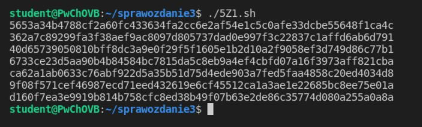

Kontener T1:

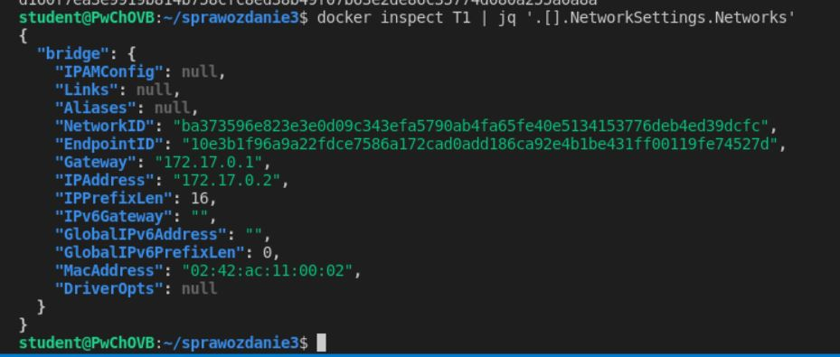

Kontener T2:

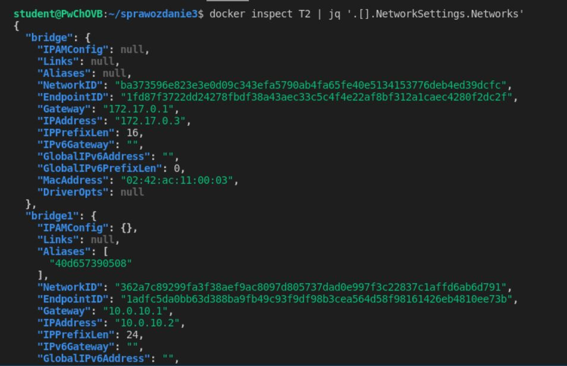

Kontener D1:

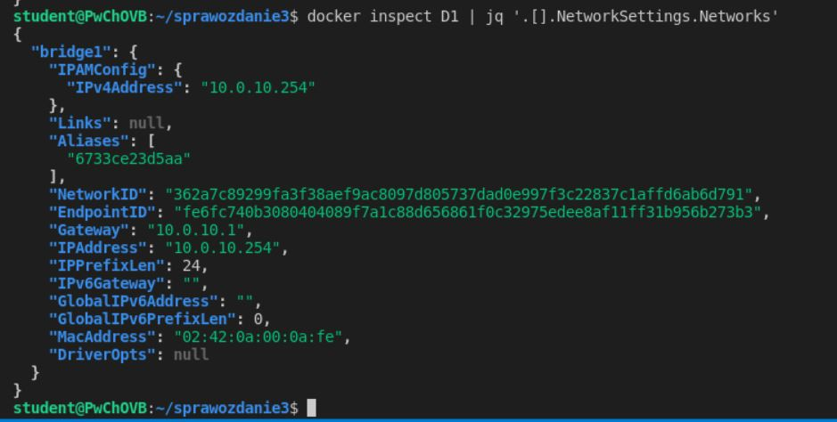

Kontener D2:

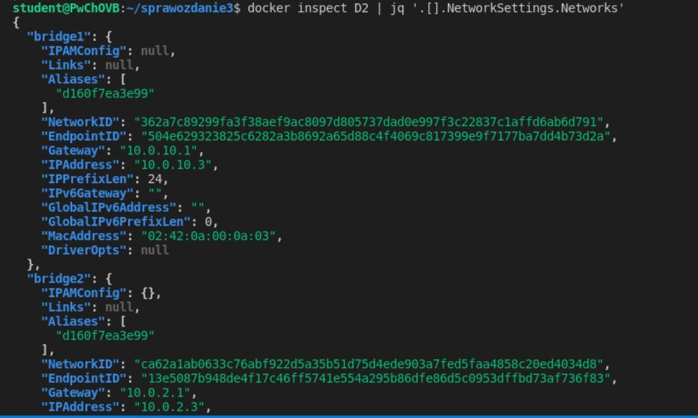

Kontener S1:

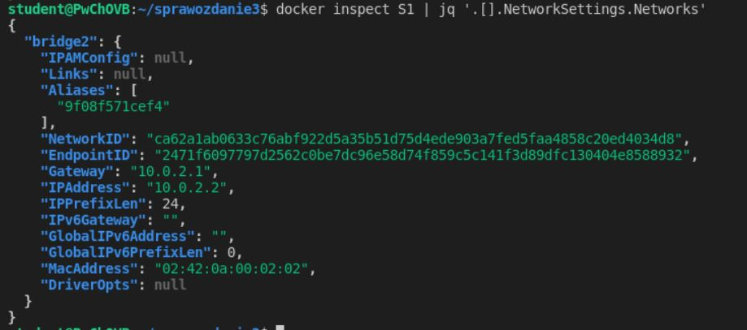

bridge1:

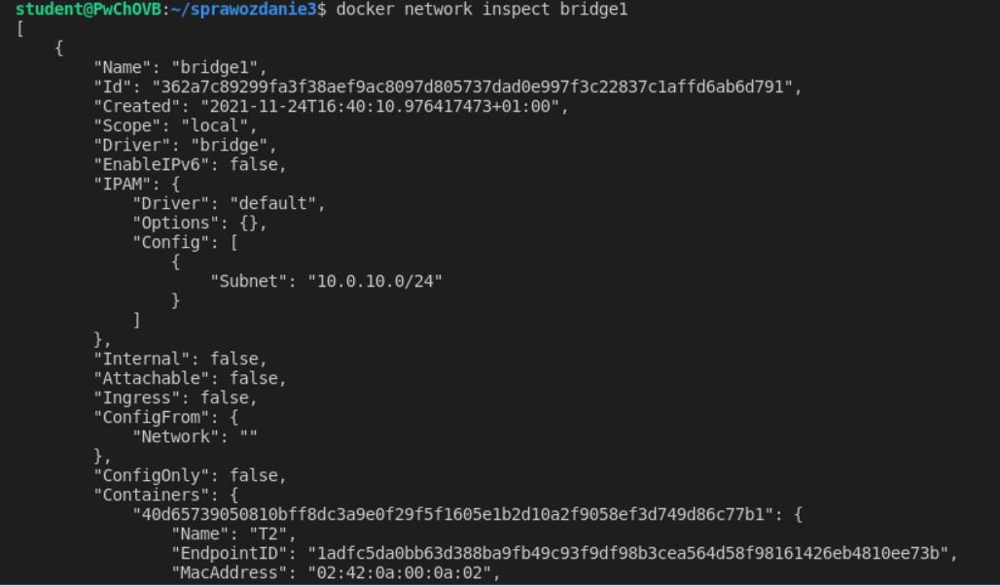
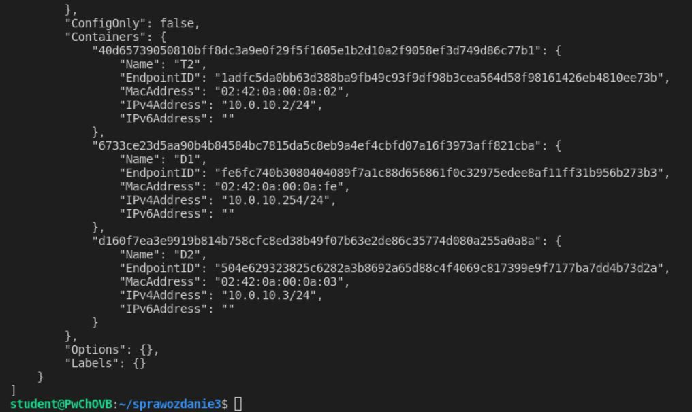

bridge2:

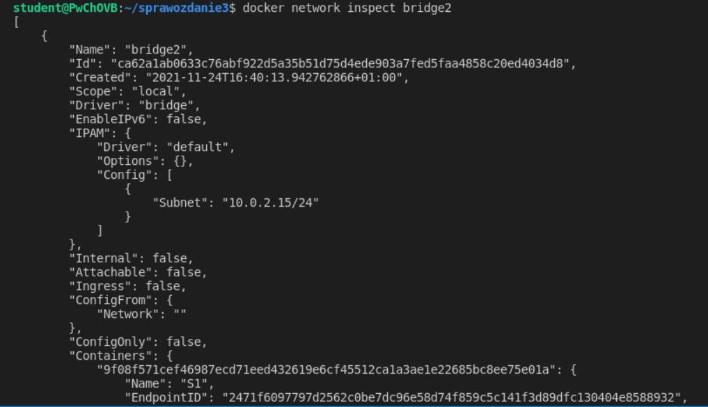
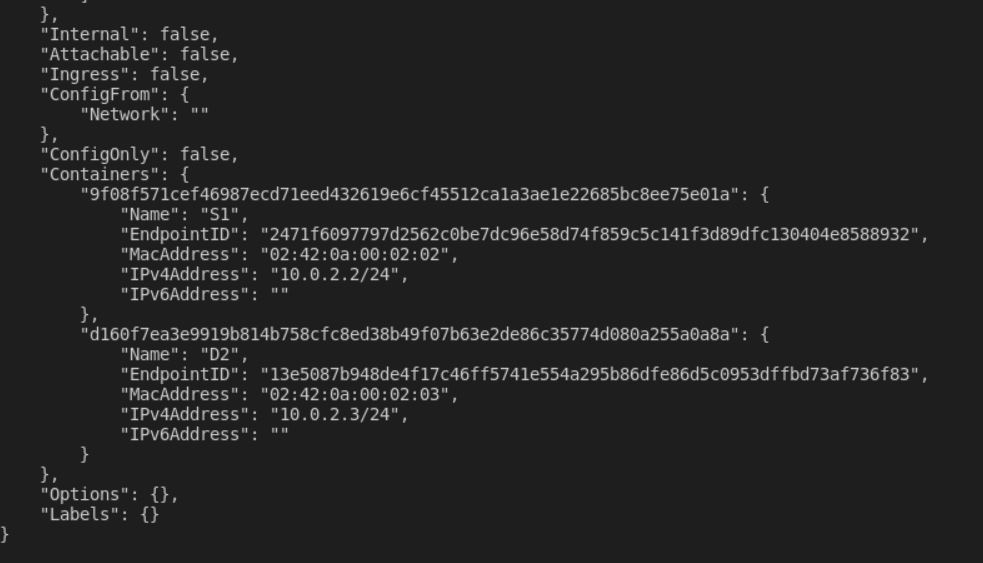

## 5Z3.
Uruchomienie skryptu 5Z3.sh :

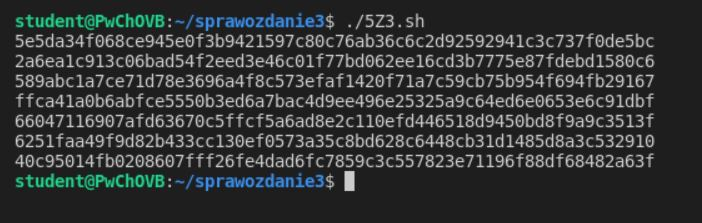

Aliasy D1:

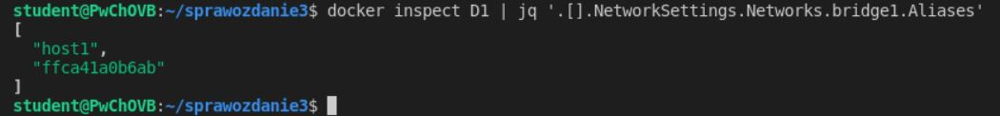

Aliasy S1:

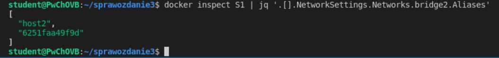

Aliasy D2:

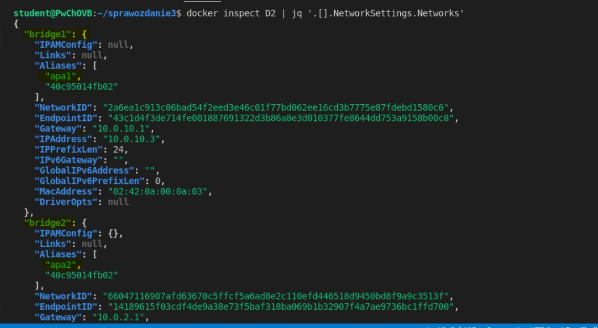

Pytanie 1

Nie można używać aliasów do komunikacji pomiędzy kontenerami przyłączonymi do dwóch różnych sieci ale pracujących w trybie mostu definiowanego przez użytkownika, ponieważ aliasy mają zasięg w jednej sieci i możliwa jest komunikacja tylko w tej samej sieci. Ping z kontenera o aliasie host1 do kontenera o aliasie host2 w innej sieci zakończył się niepowodzeniem a ping z kontenera o aliasie host1 do kontenera o aliasie apa1 który jest w tej samej sieci zakończył się sukcesem

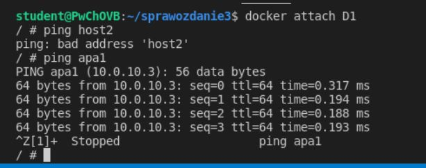
